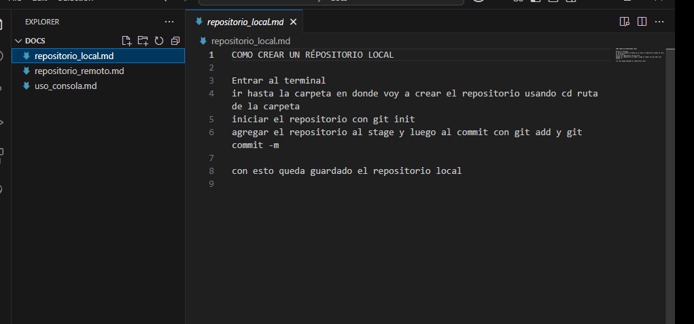

# Bitácora
Nombre del estudiante:  Sebastian Tenorio
Id.: 000489129

Microprocesadores  
2025

El proyecto consiste en aprender todos los comandos necesarios para crear carpetas, archivos y guardarlo
s con un historial de versiones para luego guardarlo todo en un repositorio remoto

para clonar y ejecutar un proyecto primero se inicializa un repositorio con git init, luego se clona un
repositorio con clon link del repositorio remoto y ya se enlaza al local

# Aquí voy a poner la tabla de contenido con enlaces

|     Nombre del Doc     |                    Enlace (PATH)                   |
|------------------------|----------------------------------------------------|
|  Uso de la consola     |   [Uso de la consola](docs/uso_consola.md)         |
|  Repositorio local     |   [Repositorio local](docs/repositorio_local.md)   |
|  Repositorio remoto    |   [Repositorio remoto](docs/repositorio_remoto.md) |

